# ♻️ Waste Management System

A comprehensive Flutter mobile application that streamlines urban waste management by connecting **residents**, **drivers**, and **city management** through a real-time, location-aware digital platform. The app aims to make cities cleaner, more efficient, and more responsive to waste-related issues.

---

## 📖 Overview

The Waste Management System is designed to modernize how urban waste is managed. It creates a digital ecosystem where:

- **Residents** can report cleanliness issues, request special pickups, and track trucks.
- **Drivers** manage routes, log breakdowns, and handle pickups.
- **City Management (Admins)** oversee the whole operation with real-time control and reporting.

By integrating all stakeholders through one app, it ensures transparent, responsive, and efficient waste management.

---

## 👤 Resident Features

- 📍 **Report Cleanliness Issues**  
  Submit garbage complaints with images and GPS-based locations.

- ♻️ **Request Special Garbage Pickup**  
  Ask for removal of large or non-standard waste.

- 🚚 **Track Waste Trucks in Real-Time**  
  View garbage truck movements and arrival times.

- 📜 **View Past Reports & Requests**  
  Access a log of submitted reports and service requests.

- 🔔 **Get Notifications**  
  Stay updated on collection schedules and issue statuses.

- 👤 **Manage Profile**  
  Change address, update profile, and manage settings.

---

## 🚛 Driver Features

- 📌 **Assigned Route Dashboard**  
  See today's routes and collection points with map guidance.

- ✅ **Mark Points as Completed**  
  Log each completed stop along the route.

- 🛠️ **Report Vehicle Breakdowns**  
  Quickly notify city admins of issues with location details.

- 📦 **Special Pickup Management**  
  Accept or decline extra waste pickup tasks.

- 🧾 **View Assigned Resident Reports**  
  Track which complaints have been assigned for resolution.

- 🔔 **Receive Notifications**  
  Get alerts about route updates, emergencies, or changes.

---

## 🏙️ City Management (Admin) Features

- 🗺️ **Create & Assign Routes**  
  Generate optimized collection routes and assign them to drivers.

- 👷 **Manage Driver Assignments**  
  Monitor drivers and reassign tasks as needed.

- 🚨 **Handle Resident Reports**  
  Review incoming complaints and assign them for action.

- 🛠️ **Manage Vehicle Breakdowns**  
  Get notified instantly and take corrective measures.

- 📦 **Approve Special Pickup Requests**  
  Review and schedule resident-initiated extra pickups.

- 📊 **Access Analytics**  
  Visual dashboards showing:
  - Report density by area
  - Route efficiency
  - Vehicle downtime
  - Pickup volumes

---

## 👥 User Roles

### 👤 Resident  
Reports issues, requests services, and tracks trucks.

### 🚚 Driver  
Fulfills garbage collection operations and provides field updates.

### 🏛️ City Management (Admin)  
Controls all backend operations including assignments, responses, and analytics.

---

## 📱 App Screens

Here's a preview of the main screens in the application:

<div align="center">

<table>
  <tr>
    <td align="center" style="padding: 15px;">
      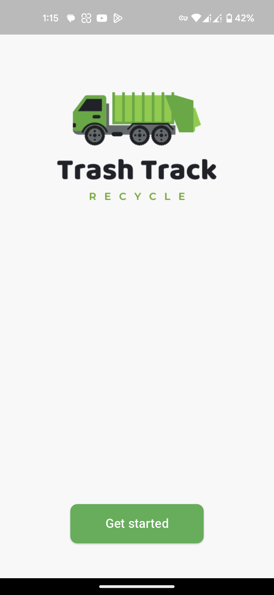<br/>
      <strong>Startup Screen</strong>
    </td>
    <td align="center" style="padding: 15px;">
      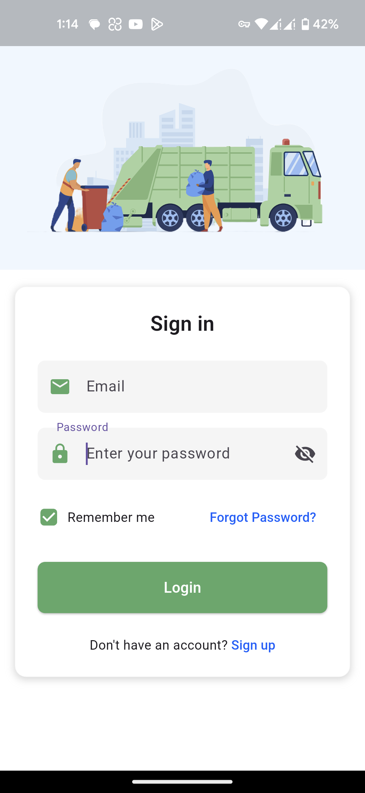<br/>
      <strong>Sign In</strong>
    </td>
    <td align="center" style="padding: 15px;">
      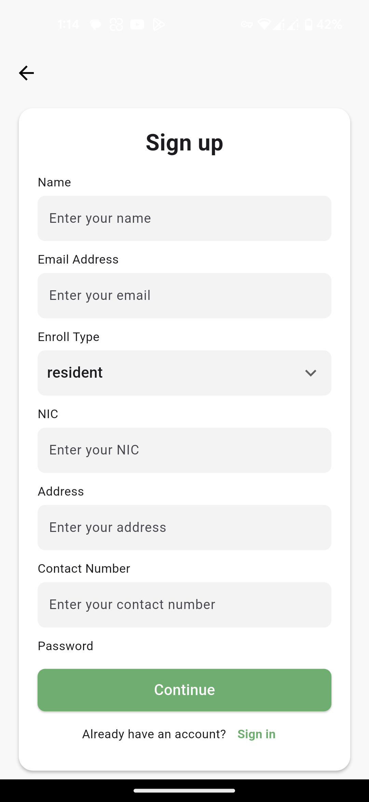<br/>
      <strong>Sign Up</strong>
    </td>
  </tr>

  <tr>
    <td align="center" style="padding: 15px;">
      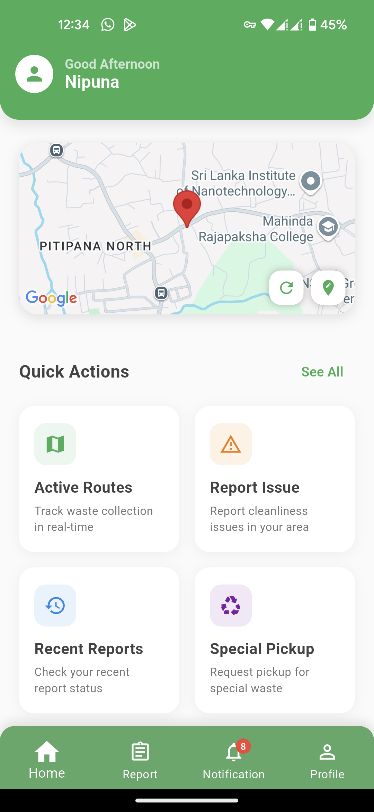<br/>
      <strong>Resident Home</strong>
    </td>
    <td align="center" style="padding: 15px;">
      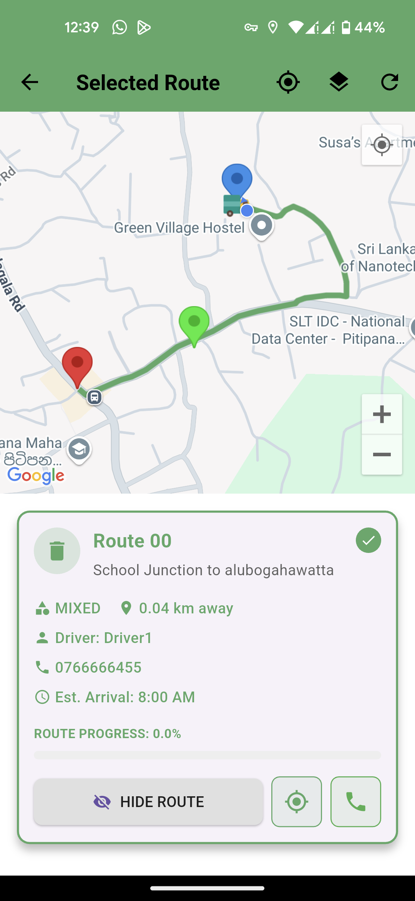<br/>
      <strong>Track Waste Truck</strong>
    </td>
    <td align="center" style="padding: 15px;">
      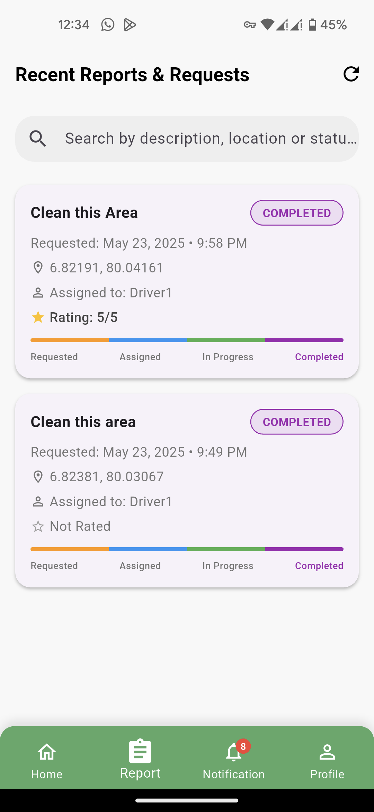<br/>
      <strong>Recent Reports</strong>
    </td>
  </tr>

  <tr>
    <td align="center" style="padding: 15px;">
      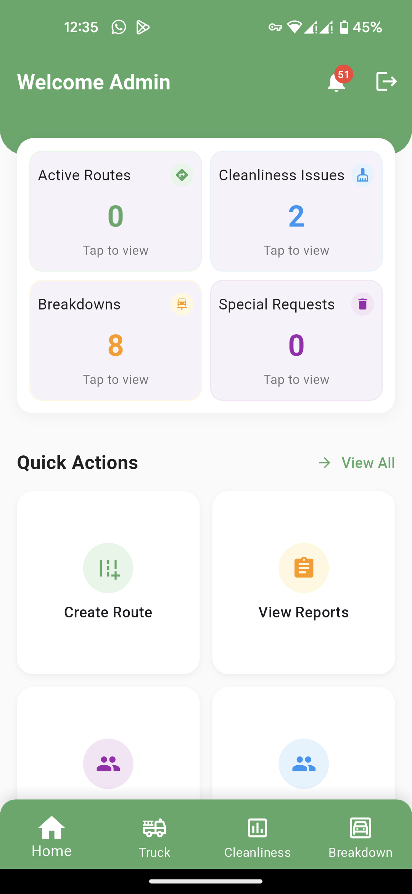<br/>
      <strong>City Home</strong>
    </td>
    <td align="center" style="padding: 15px;">
      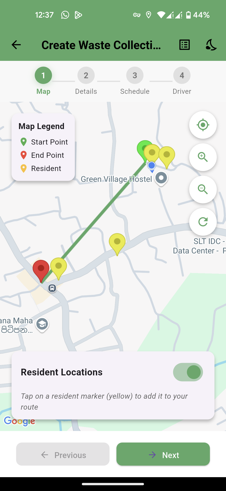<br/>
      <strong>Create Route</strong>
    </td>
    <td align="center" style="padding: 15px;">
      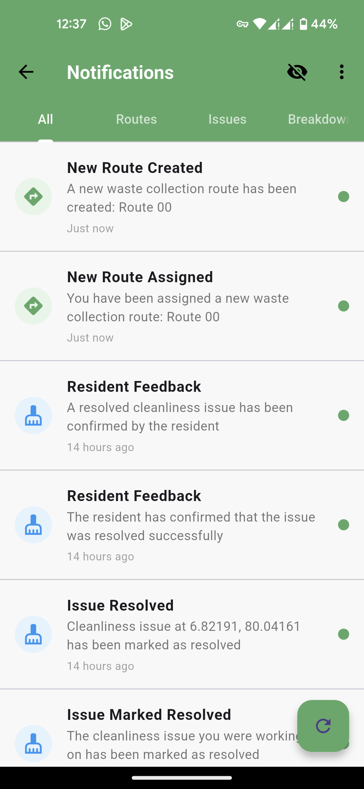<br/>
      <strong>Notifications</strong>
    </td>
  </tr>

  <tr>
    <td align="center" style="padding: 15px;">
      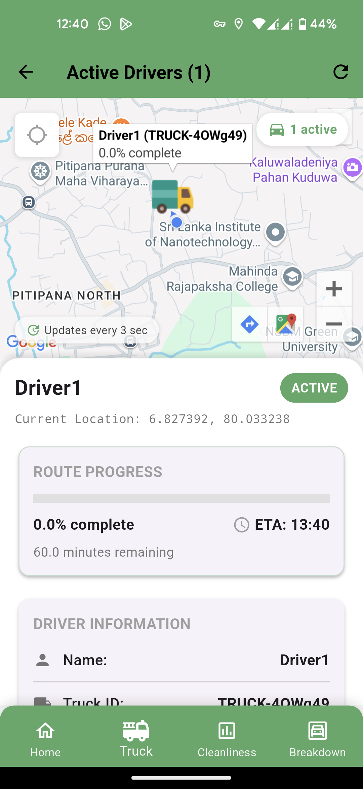<br/>
      <strong>Active Trucks</strong>
    </td>
    <td align="center" style="padding: 15px;">
      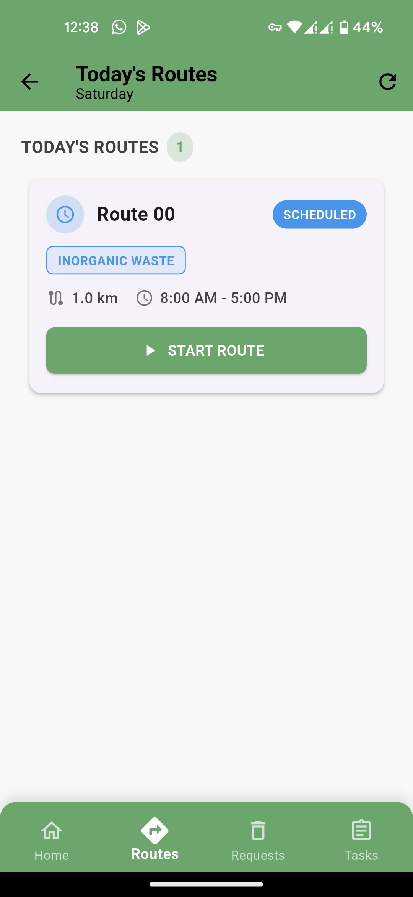<br/>
      <strong>Driver Schedules</strong>
    </td>
    <td align="center" style="padding: 15px;">
      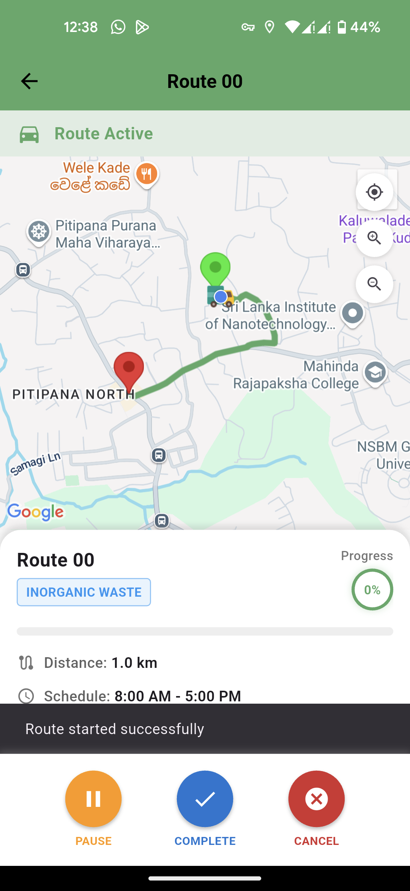<br/>
      <strong>Route Start</strong>
    </td>
  </tr>
</table>

</div>

---
  
## 🛠️ Technologies Used

- **Frontend**: Flutter (Dart)
- **Backend**: Firebase Firestore, Firebase Authentication, Firebase Storage, Firebase Cloud Messaging
- **Location & Maps**: Google Maps SDK, Geolocator
- **Authentication**: Firebase Auth, Google Sign-In
- **Notifications**: Firebase Messaging
- **State Management**: Provider

---
## Team Members

<div align="left">

|  |  |  |  |  |  |  |  |
|:-------------------------:|:-------------------------:|:-------------------------:|:-------------------------:|:-------------------------:|:-------------------------:|:-------------------------:|:-------------------------:|
| **Lakshitha Wijerathne** | **Minusha Athapaththu** | **Dananjana Uyangoda** | **Manujaya Rathnayake** | **Lakshani Subasinghe** | **Gunasingha KGNN** | **Pemidu Ranisha Herath** | **thanushkadilhara** |
| [@mlswijerathne](https://github.com/mlswijerathne) | [@AHLDTminusha](https://github.com/AHLDTminusha) | [@Dananjana03](https://github.com/Dananjana03) | [@jmbrathnayke](https://github.com/jmbrathnayke) | [@lakshyieS](https://github.com/lakshyieS) | [@Nipuna7](https://github.com/Nipuna7) | [@PemiduHerath](https://github.com/PemiduHerath) | [@thanushkadilhara](https://github.com/thanushkadilhara) |

</div>


---

## ⚙️ Setup Instructions

1. **Clone the repository**  
   ```bash
   git clone https://github.com/your-username/waste-management-system.git
   cd waste-management-system
   ```

2. **Install Flutter**  
   Make sure Flutter is installed and set up on your machine. If not, follow the [official Flutter installation guide](https://flutter.dev/docs/get-started/install).
   ```bash
   flutter --version
   ```

3. **Install dependencies**  
   ```bash
   flutter pub get
   ```

4. **Firebase Setup**  
   - Create a Firebase project in the [Firebase Console](https://console.firebase.google.com/)
   - Enable Authentication, Firestore, Storage, and Cloud Messaging
   - Download `google-services.json` and place it in the `android/app` directory
   - Download `GoogleService-Info.plist` and place it in the `ios/Runner` directory
   - Configure the Firebase options in `lib/firebase_options.dart`

5. **Google Maps API Key**  
   - Get an API key from the [Google Cloud Platform Console](https://console.cloud.google.com/)
   - Enable Maps SDK for Android and iOS
   - Add the API key to:
     - `android/app/src/main/AndroidManifest.xml` 

6. **Run the app**  
   ```bash
   flutter run
   ```


